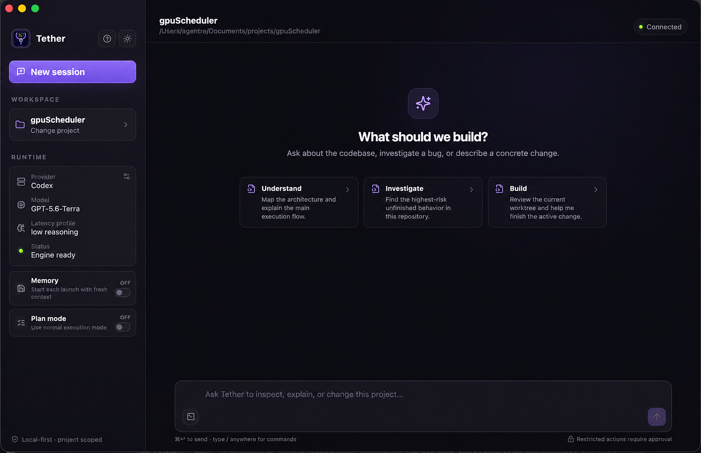

Tether
========

**Not another harness.**

Every coding agent ships the same loop: prompt → tools → model → repeat. Swap
the model, swap the shell, and you have a new product with the same weakness —
it wakes up every session as a first-day contractor. It greps and embeds its way
to a working theory of your repo, does the task, exits, and the theory
evaporates. Six months in, it knows nothing on Monday that it didn't know on
day one.

<p align="center">
  
</p>

Tether keeps the loop and fixes the amnesia. The model is replaceable; the
project understanding stays **tethered to you**.

> ### The persistence model — why it matters
>
> Tether keeps a **persistent codebase mental model** per repository: a
> queryable store of what the agent has *concluded* about your code — what
> owns what, what a change affects, which patterns are allowed — with every
> conclusion **cited to a specific slice of the repo at a specific commit** so
> it can be re-checked instead of trusted.
>
> That is the difference between an assistant and a colleague. A colleague who
> has worked in your repo for six months answers "what does touching
> `RefundService.refund` break?" from memory and then glances at the code to
> confirm; a harness re-derives it from grep every time, inconsistently, and at
> full token cost. The model is consulted **before** retrieval, beliefs demote
> themselves as the code drifts, architectural rules compile to graph queries
> that return counterexamples, and the store's growth is bounded by the active
> surface of work — not by repo size or history. None of it lives in the model,
> so switching providers costs you nothing.
>
> Two runnable proofs, not a promise. (1) The retention test: delete the
> derived index, disable grep and embeddings, and the agent must still answer
> *affects / owns / allowed* from retained beliefs, re-fetching only the cited
> slices to verify — it passes. (2) The cost test
> ([`docs/persistence-benchmark.md`](docs/persistence-benchmark.md)): the same
> model answering the same questions about this repo, with and without the
> persistent model — **36% fewer tool calls, 32% fewer tokens, 20% faster,
> and 100% vs 92% recall**; an "is this allowed?" question drops from 14 tool
> calls to 4.5. Where the model has nothing recorded, consulting it costs a
> little — the store has to be load-bearing, so Tether learns automatically:
> after each substantive turn it records what the turn established, every
> claim cited to a real file at the current commit. Details below and in
> [`docs/codebase-mental-model/`](docs/codebase-mental-model/).

Local-first, model-flexible, terminal and desktop. Run fully offline with
`llama.cpp` and an open-weight GGUF, or point the same harness at DeepSeek,
Kimi, OpenAI, GLM, Anthropic, Codex, or any OpenAI-compatible endpoint. Nothing
about your project knowledge changes when the model does.


Why it is different
-------------------

Three things Tether does that a harness does not:

**1. It keeps conclusions, not transcripts.**
Underneath every interface is a persistent, queryable **codebase mental model**
([`core/codebase_model/`](core/codebase_model/), designed in
[`docs/codebase-mental-model/`](docs/codebase-mental-model/)). Two layers with
opposite cost models, kept strictly separate:

| | Derived substrate | Inferred layer |
|---|---|---|
| Produced by | parsers / static analysis | the model, while it works |
| Regenerable? | yes — a view of `HEAD`, rebuilt in `O(Δ)` | no — each belief cost an LLM call |
| Confidence? | none; it is ground truth | yes; defeasible, demoted as code drifts |
| Where bugs hide | nowhere (re-runnable) | here — so this layer is built to be *checked* |

The agent consults the model **before** retrieval — *what owns refunds, what
does this change affect, is this pattern allowed here* — and only then fetches
code. Grep and embeddings are the fallback, not the first move.

**2. Beliefs are checkable, not merely asserted.**
The design's one through-line: *maximize the fraction of the model that is
checkable; minimize the fraction that is asserted.* Every belief carries a
content-addressed citation into the repo itself
(`billing/refunds.py @ RefundService.refund @ commit abc123`), so it can be
re-fetched and re-verified long after whatever index produced it is gone.
Architectural rules are compiled to deterministic graph queries that return
counterexamples with a file and a line, not a confidence score. Conflict
resolution branches on belief type — derived facts refresh, descriptive beliefs
demote, prescriptive invariants raise a violation — so a rule the code breaks is
reported as a violation instead of being quietly "updated" away.

There is a runnable acceptance test for whether any of this is real: build the
model, **delete the entire derived substrate, disable grep and embeddings**, and
hand the agent a task. If it still answers *affects / owns / allowed* from
retained beliefs and re-fetches only the cited slices to verify before editing,
it learned. If it stalls, the beliefs were decoration. That test passes today
([doc 11](docs/codebase-mental-model/11-acceptance-test.md)). Drive it with
`/persistence` in the REPL.

**3. The system around the model compounds; the model is a commodity.**
The store fills as a by-product of work: after each substantive turn a small
extraction pass records durable, cited beliefs, invariants and decisions
(`codebase_model_auto_learn`), the substrate re-indexes edited files, and the
desktop builds the model in the background on first open. Skills, session
history, approvals, tool traces, task checklists, and
project-specific learning live in Tether and survive a provider switch. Growth is
bounded by the *active surface area of work*, not by repo size or history, so
the store stays small and honest as the code churns underneath it for years.
Switching models is cheap because nothing you have taught Tether about your
project is stored in the model.

Provider menus and a desktop shell make Tether accessible. The compounding,
model-independent project knowledge is the part that is hard to copy.


Desktop app
-----------

The desktop app in `desktop/` (React, TypeScript, Tauri) is the same Tether,
scoped to one project. Pick a folder, and you get a multi-turn session with
streamed model and tool activity, tool cards, live sub-agent cards, a task
checklist, queued follow-ups, background shell jobs, and optional LSP
navigation — all running on the same Python engine and tools as the terminal.
The runtime sheet switches between local GGUF and any remote provider, with
model-specific reasoning controls and per-provider key setup.

Anything restricted asks first: **Allow once**, **Allow full session**, or
**No** — and a No ends the turn and hands control back to you.

First launch sets itself up: the app checks for the Tether engine and, if it's
missing, installs it for you (pipx, no sudo) and builds llama.cpp on request
for local models — all from a dialog with a live log. `tether doctor` shows
the same status from the terminal.

```bash
cd desktop
npm install
npm run desktop:dev                 # development
npm run dmg                         # macOS: dist/macos/Tether-VERSION.dmg
npm run linux                       # Linux (experimental): dist/linux/*.{AppImage,deb,rpm}
```

macOS is the supported desktop platform. The **Linux port is experimental**:
it builds and packages in CI (AppImage/deb/rpm, needs `bubblewrap` for the
shell sandbox) but has not been exercised end to end yet — expect rough edges
around the window chrome and WebKitGTK rendering. See
[`docs/desktop-app.md`](docs/desktop-app.md) for the architecture, platform
requirements, packaging, and roadmap.

When moving the project to a fresh repository, use the sanitized export process
in [`docs/repository-handoff.md`](docs/repository-handoff.md).


Requirements
------------

- **Python 3.10 or newer.**
- **For local mode:** a GGUF model file, plus enough VRAM to load it. CUDA / Metal acceleration is optional but expected. `llama.cpp` is built for you by `tether setup`.
- **For remote mode:** an API key for your chosen provider. Nothing else to install.
- `prompt_toolkit` and `pygments` are pulled in automatically as package dependencies.


Install
-------

The goal is to make `tether` callable from any directory while preserving an
editable source install.

### Fast path — clone, seed config, install

The repo ships a sanitized `config/config.json.example` (empty key fields). The real `config/config.json` is gitignored — keys belong in the environment or in `~/.tether/config.json`, never in the repo.

```
git clone https://github.com/agentrebench/Tether.git Tether
cd Tether
./bin/tether-install-config           # seeds ~/.tether/config.json (0600) from config/config.json[.example]
pipx install -e .                        # or: pip install --user -e .
tether remote <provider>                 # pick a provider; it prompts for a key if none is set
tether start                             # terminal REPL
```

`tether-install-config` is idempotent: it refuses to clobber an existing `~/.tether/config.json` unless you pass `--force`. It prefers a local (gitignored) `config/config.json` if you keep one, and falls back to the tracked example. Any remote provider gets you a working REPL on first run with just an API key — no GGUF or llama.cpp build needed.

The config keeps `model_path` empty. Set it (or run `tether start` and use the interactive model selector) only when you want local-llama mode.

### Recommended — pipx

```
brew install pipx          # macOS  (or: sudo apt install pipx on Debian/Ubuntu)
pipx ensurepath            # adds ~/.local/bin to PATH; restart shell after

git clone https://github.com/agentrebench/Tether.git Tether
cd Tether
pipx install -e .
which tether             # ~/.local/bin/tether
```

pipx puts each CLI in its own isolated venv under `~/.local/pipx/venvs/tether/` and symlinks the entry point into `~/.local/bin/`. Editable mode is preserved — no reinstall after `git pull`.

To add an extra Python package later, use `pipx inject tether <pkg>` rather than activating the pipx venv directly.

### Fallback — `pip --user`

If you can't use pipx for some reason:

```
python3 -m pip install --user -e .
```

On macOS, the user-site binary directory can be
`~/Library/Python/<version>/bin/` rather than `~/.local/bin/`. If pip reports
that the script directory is not on `PATH`, add the exact directory it prints:

```
echo 'export PATH="$HOME/Library/Python/X.Y/bin:$PATH"' >> ~/.zshrc
source ~/.zshrc
which tether
```

Note: that path is version-pinned. If you ever upgrade the Python you installed against, update the export.

### Migrating from a venv-only install

If you originally ran `pip install -e .` inside an active venv, the entry point is locked to that venv. To go global, leave the venv first, then re-install via pipx:

```
deactivate
cd /path/to/tether
pipx install -e .
/path/to/old/venv/bin/pip uninstall tether   # optional cleanup
```


Using a remote API
------------------

The remote path doesn't need `llama.cpp`, a GGUF, or a GPU. Any built-in
provider works the same way — the model is a setting, not a harness.

```
tether remote                # list providers and show the current one
tether remote <provider>     # deepseek | kimi | openai | glm | anthropic | codex | custom
```

**1. Get a key** from the provider of your choice. Treat it like a password —
anyone holding it can spend money on your account. If it ever leaks (pasted in
chat, committed, screenshotted), rotate it immediately.

**2. Make the key visible to Tether.** Pick one:

**Option A — environment variable (preferred, never on disk).** Each provider
reads a conventional variable; `tether remote <provider>` prints the one it
expects, and `tether key` shows whether it's set:

```
echo 'export <PROVIDER>_API_KEY="...your-key..."' >> ~/.zshrc   # e.g. OPENAI_API_KEY, KIMI_API_KEY
source ~/.zshrc
```

Caveats:
- `~/.zshrc` is sourced for *interactive* zsh shells only. GUI launchers and cron read `~/.zshenv` instead — put it there if you ever invoke `tether` from one of those.
- If you sync dotfiles to GitHub, don't commit `.zshrc` with raw keys. Either gitignore it or move the export to `~/.zshrc.local` and `source` that from `.zshrc`.

**Option B — stored in config (convenient, plaintext on disk):**

```
tether remote <provider>
tether key set                                  # prompts; input is hidden
echo "...your-key..." | tether key set          # or pipe it in
```

Tether chmods `~/.tether/config.json` to `0600` on every save so other accounts on the box can't read it. Keys are stored per provider, so switching providers doesn't lose them. The env var still wins when both are set.

**3. Run:**

```
tether remote                                   # confirms: provider=<name>, api key=set
tether start
```

If neither key source is configured when you run `tether remote <provider>`, it offers to capture and store one inline. Inside the REPL, `/provider <name>` or `/model` switches providers without restarting.

**Custom OpenAI-compatible endpoint** (anything speaking `/v1/chat/completions`):

```
tether remote custom \
    --base-url https://api.example.com \
    --model <model-id> \
    --api-key-env MY_API_KEY
export MY_API_KEY="..."     # or: tether key set
tether start
```


Using a local GGUF model
------------------------

The offline / no-API-bill path. Needs a GGUF model on disk and `llama.cpp` built locally.

**1. First-time setup** — clone llama.cpp and build llama-server:

```
tether setup
```

This is a one-time cost. `llama.cpp` is cloned into `~/.tether/llama.cpp` (or next to a git checkout of Tether if you develop from one; override with `TETHER_LLAMA_CPP_DIR`). Repeat the setup only if you delete that. The desktop app runs the same step from its Setup dialog.

**2. Get a model.** Two common paths:

- **Hugging Face CLI:** `huggingface-cli download <repo>` drops files in `~/.cache/huggingface/hub/` and Tether picks them up automatically.
- **Manual download:** drop `.gguf` files into a directory under one of these auto-discovered paths:
  - `~/Projects/*-GGUF/` (e.g. `~/Projects/Qwen3.6-35B-A3B-GGUF/`)
  - `~/Projects/models/`

Or register a custom location:

```
tether models                                    # show what's discovered
tether models add-dir /Volumes/External/ggufs    # remember across runs
tether models remove-dir /Volumes/External/ggufs # undo
tether start --gguf-dir /tmp/some-folder         # one-shot, no config write
```

**3. Make sure you're in local mode** (only if you came from a remote setup):

```
tether remote off
```

This restores the local `llama-server` provider and the previous `context_size`.

**4. Run it:**

```
tether start
```

An interactive selector lists every model found, with format / size / native context length. Tether auto-tunes `context_size`, `parallel_slots`, and KV cache type to fit your GPU memory, then launches `llama-server` in the background and drops you into the REPL.

Skip the selector when you know the path:

```
tether start --model ~/Projects/Qwen3.6-35B-A3B-GGUF/Qwen3.6-35B-A3B-Q8_0.gguf
tether stop                                      # kills the background llama-server
```


Switching between modes
-----------------------

State lives in `~/.tether/config.json` and persists across reboots:

```
tether remote <provider>  # remote mode (deepseek, kimi, openai, glm, anthropic, codex, custom)
tether remote off         # back to local llama-server
tether remote             # show current mode
```

Local model selection, KV-cache tuning, and context size are stashed when you switch to remote and restored when you switch back, so flipping doesn't lose the auto-tuned local settings.

For CI, portable installs, or managed environments, set `TETHER_CONFIG_DIR` to
redirect all runtime state without changing the process home directory.


CLI reference
-------------

```
tether start          # start server if needed, then open the REPL
tether run            # alias of start
tether serve          # run llama-server in the foreground
tether stop           # stop the background llama-server
tether setup          # clone llama.cpp + build llama-server (~/.tether/llama.cpp)
tether doctor         # what is installed: python, llama-server, provider (--json)
tether config         # print current config (api_key is masked)

tether remote                          # show current provider
tether remote <provider>               # switch to a built-in preset
tether remote custom --base-url … --model … --api-key-env …
tether remote off                      # back to local

tether key                             # show env var / stored key status
tether key set                         # prompt for key (hidden); pipeable
tether key clear                       # remove stored key

tether models                          # list built-in + user-added GGUF dirs
tether models add-dir <path>           # remember a directory
tether models remove-dir <path>

# common flags on start/run
--port <n>                # override server port
--model <path>            # skip the interactive selector
--gguf-dir <path>         # add an extra GGUF search dir for this run
```


REPL features
-------------

Startup status for model, runtime, workspace, tools, agent capacity. A live context bar showing estimated token usage. Approval prompts for restricted tools. Session saving, conversation compaction, summary snapshots, and persistent memory across sessions.

Slash commands:

```
/help
/clear                                  # clear context completely
/compact                                # summarize, save, then trim context
/history                                # show event history
/usage                                  # token usage
/context                                # context-window usage
/session                                # session id + cwd
/cd <path>                              # change working directory
/save                                   # save session to disk
/memory                                 # update persistent memory
/memory show
/memory clear
/selfcheck                              # quick compile/import smoke checks
/selfcheck deep                         # plus the unit suite
/selfcheck show                         # last saved selfcheck report
/summaries                              # list saved conversation summaries
/provider                               # show current model provider
/provider <name>                        # switch (e.g. openai, kimi, local)
/model [stats|local|<provider>]         # LLM model & token usage
/persistence [status|build|…]           # the persistent codebase mental model
/skills                                 # list installed workflow skills
/learn                                  # capture project learning
/quit
```

`/selfcheck` runs a fast smoke test against the current `tether` codebase in a separate subprocess. The result is saved under `~/.tether/selfcheck/`, written into persistent memory, and injected back into the running session — so the agent can fix breakages it just introduced.

The desktop starts each launch with fresh context by default. Its **Memory**
switch, directly below Runtime, opts into disk-backed memory and project task
continuity across launches. Switching providers or models inside one live
session always keeps the active conversation, independently of that switch.
The adjacent **Plan mode** switch is session-only and starts off after a new
launch or New session.


What the agent can do
---------------------

Tools available to the model:

```
bash          Run shell commands with persistent working-directory state
file_read     Read files with line numbers
file_edit     Edit files using exact, line-based, insert, or append modes
file_write    Create or overwrite files
glob          Find files by pattern
grep          Search file contents with ripgrep / grep
ask_user      Ask 1-3 blocking clarification questions in the active client
todo_write    Replace the durable task checklist for multi-step work
job_list      List background commands owned by the current session
job_output    Read bounded output and status for a background command
job_kill      Stop a background command started by Tether
lsp           Definitions, references, hover, and symbols through an installed language server
agent         Launch sub-agents for parallel or scoped work
web_fetch     Fetch and reduce a web page (bounded size)
model_query   Ask the codebase mental model: affects / owns / allowed
model_record  Record a belief, invariant, or decision with a cited slice
model_check   Run compiled invariants against a diff and return counterexamples
```

Set `run_in_background=true` on `bash` for long-lived commands. Background
output is bounded in memory and remains available through the job tools until
the session ends. LSP navigation supports TypeScript/JavaScript, Python, Rust,
and Go when a compatible server (`typescript-language-server`,
`pyright-langserver`/`pylsp`, `rust-analyzer`, or `gopls`) is on `PATH`.

Desktop file tools canonicalize every path and reject absolute, relative, or
symlink escapes from the selected project. Before a desktop shell command is
launched, Tether also rejects explicit home-directory, parent-traversal, and
absolute user-data paths that resolve outside the project or temporary storage.
The command then runs under an OS write sandbox: macOS Seatbelt or Linux
bubblewrap. System toolchain reads and network access remain available so
compilers and package managers can work, while writes are limited to the
selected project and temporary directories. Linux desktop users must install
`bubblewrap`; Tether fails closed when the sandbox is unavailable. The terminal
client remains unrestricted unless embedded with an enforced workspace policy.

Built-in agent types:

```
explore       Fast codebase exploration with read/search tools
plan          Read-only planning and architecture work
general       Full tool access for complex implementation tasks
```

Sub-agents can be launched singly, repeated with a `count`, or fanned out across explicit `tasks`.


Configuration
-------------

Lives at `~/.tether/config.json` (mode `0600`).

Important fields and defaults:

```
host                      127.0.0.1
port                      8080
context_size              131072
gpu_layers                -1
gpu_memory_utilization    0.60
parallel_slots            4
max_turns                 50
max_budget_tokens         200000
compact_after_turns       20
temperature               0.7
top_p                     0.9
auto_approve_reads        true
auto_approve_edits        true
auto_approve_bash         false
provider                  local
api_base_url              ""
api_model                 ""
api_key_env               ""
api_key                   ""        # legacy single-key fallback
api_keys                  {}        # write-only per-provider keys from CLI/GUI
reasoning_effort          ""        # model-specific: none/low/medium/high/max/xhigh
thinking_mode             ""        # enabled/disabled for compatible APIs
gguf_dirs                 []        # extra dirs from `tether models add-dir`
codebase_model_enabled    true      # persistent codebase mental model (/persistence)
codebase_model_auto_learn true      # record cited beliefs after each substantive turn
```

By default Tether auto-approves read and file-edit operations so routine work doesn't get stuck behind repeated confirmation prompts. Shell commands and sub-agent launches still require approval unless you change the config.

When `provider` is anything other than `local`, the engine talks to `api_base_url` using the first configured provider environment variable (or that provider's entry in `api_keys`) instead of the local server. Reasoning effort and thinking controls are validated against the selected model; unsupported sampling fields are omitted automatically.

Model lists are not frozen: once a provider has a key, Tether asks its
`/models` endpoint what it actually serves and merges new ids into the picker
(newest first, controls inherited from the provider's default model), so a
model released after this build still shows up. Offline or without a key you
get the built-in catalog.


How it works
------------

```
You <-> Tether REPL / desktop <-> Query Engine <-> [llama-server | remote API] <-> model
                                      |
                                      +-- tools, skills, approvals, sessions
                                      +-- persistent codebase mental model (SQLite, per repo)
```

The query engine runs an agentic loop. The model can inspect files, call tools,
review results, make edits, and keep iterating until the task is complete or a
budget limit is reached. Before it reaches for grep it can ask the codebase
model what a change affects, what owns a concept, or whether a pattern is
allowed — and the answers survive the session, the model, and the provider.


Development
-----------

The repository root *is* the `tether` package, so tests import it as
`tether.*`. Install editable, then run the suite:

```
pipx install -e .            # or: python3 -m pip install --user -e .
python3 -m pytest -q
```

Secrets never live in the repo: `config/config.json` is gitignored,
`config/config.json.example` ships with empty key fields, and `tether config`
masks keys when printing. Before publishing a fork, run the sanitized export in
[`docs/repository-handoff.md`](docs/repository-handoff.md).


Project layout
--------------

```
Tether/
    LICENSE                     MIT license
    pyproject.toml              Package metadata (used by pipx install -e .)
    cli.py                      CLI entrypoint and server lifecycle commands
    app_bridge.py               NDJSON bridge used by the desktop host
    desktop/                    React, TypeScript, and Tauri desktop app
    core/
        config.py               Config model, defaults, remote presets
        models.py               Message, tool, and usage data structures
        permissions.py          Tool approval and denial logic
        cache.py                Thread-safe TTL cache used by tools/engine
        logging.py              File + console logging setup
        skills.py               Reusable workflow skills (SKILL.md store)
        learning.py             Project-specific learning episodes
        codebase_model/         Persistent codebase mental model (see its README)
            store.py            SQLite source of truth (nodes, edges, beliefs, invariants)
            substrate*.py       Parser-derived ground truth, Python + generic languages
            beliefs.py          Defeasible belief cache: supersession, demotion, eviction
            invariants.py       Invariant compiler: rules → graph queries → counterexamples
            query.py            affects / owns / allowed / answer
            acceptance.py       The "delete the substrate, still answer" benchmark
    engine/
        backend.py              OpenAI-compatible client (local + remote)
        codex_backend.py        Codex CLI backend adapter
        query_engine.py         Agent loop, tool orchestration, memory, streaming
    tools/
        bash.py                 Shell execution
        file_read.py            File reads with line numbers
        file_edit.py            Multi-mode file editing with diff previews
        file_write.py           File creation and overwrite
        glob_tool.py            Path globbing
        grep_tool.py            Content search
        workspace.py            Canonical project paths + shell write sandbox
        jobs.py                 Background process registry and controls
        todo.py                 Durable task checklist
        lsp.py                  Narrow stdio LSP client
        agent_tool.py           Sub-agent runtime and fan-out execution
        codebase_model_tool.py  model_query / model_record / model_check
        skills_tool.py          Skill discovery and loading
        skill_manage.py         Create/update skills from a session
        web_fetch.py            Bounded web page fetch
        ask_user.py             Blocking clarification questions
    agents/
        base.py                 Shared sub-agent framework
        builtin.py              Built-in agent definitions
    session/
        store.py                Saved sessions
        history.py              Event log
        input_broker.py         Thread-safe interactive input handoff
        rationale.py            Rationale and evidence records
    ui/
        repl.py                 Terminal REPL
        banner.py               Startup banner
        colors.py               Terminal styling
        highlight.py            Inline syntax highlighting
        markdown.py             Streamed-prose renderer
    docs/
        codebase-mental-model/  Design spec for the persistence model (read 00 → 11)
        desktop-app.md          Desktop architecture, packaging, roadmap
        repository-handoff.md   Sanitized export process
    tests/                      pytest suite (needs the package importable as `tether`)
```
